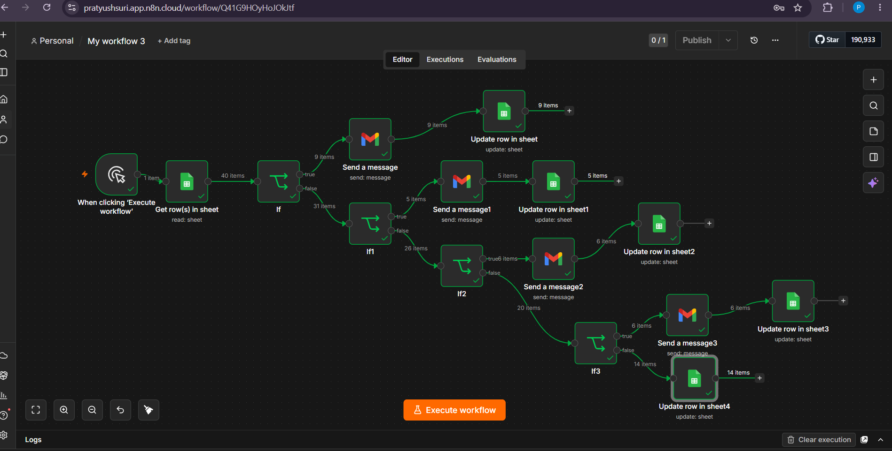
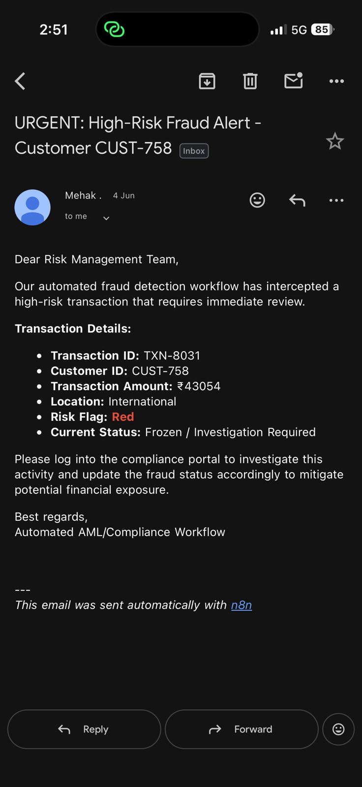
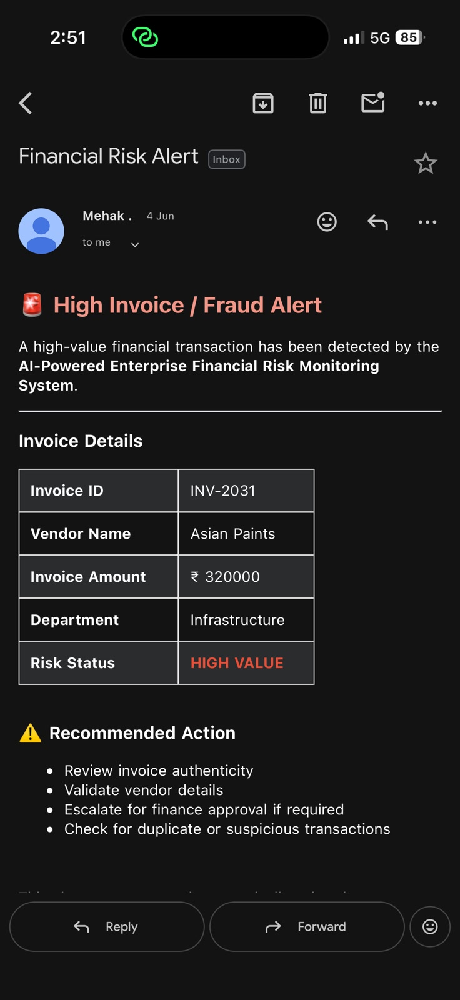
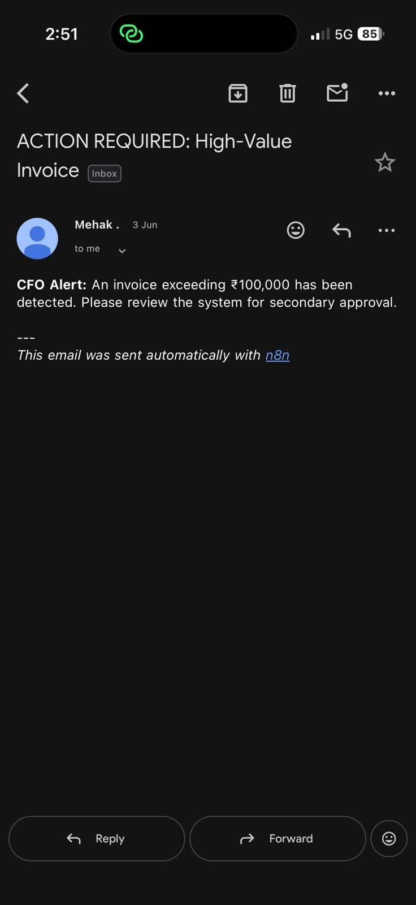

## Fraud Detection Automation System
## Project Overview

This project automates the fraud detection and loan risk assessment process using n8n workflow automation, Gmail notifications, Google Sheets, and Power BI dashboards. The system analyzes financial risk data, updates records automatically, sends alerts via email, and visualizes key insights through an interactive dashboard.

## Objectives
Automate fraud and financial risk monitoring.
Streamline loan approval decision-making.
Maintain centralized records in Google Sheets.
Send automated email notifications for risk alerts.
Visualize fraud and loan analytics through Power BI.

## Tools & Technologies
n8n – Workflow Automation
Gmail API – Automated Email Notifications
Google Sheets – Data Storage & Updates

AI-Based Risk Logic – Fraud Detection and Loan Assessment

## Workflow Architecture
Financial data is received and processed through n8n.
Risk analysis identifies potential fraud indicators.
Loan applications are evaluated based on predefined criteria.
Results are automatically recorded in Google Sheets.
Gmail sends alerts and status updates to stakeholders.

## Features
Automated Risk Assessment
Detects high-risk financial activities.
Generates risk alerts automatically.
Loan Approval Automation
Evaluates applications using predefined rules.
Flags suspicious or high-risk cases.
Google Sheets Integration
Automatically updates records.
Maintains centralized audit trail.

## Gmail Notifications
Sends automated approval, rejection, and risk alert emails.
Provides real-time communication.
Fraud case monitoring.
Risk score visualization.
Loan approval analytics.
Performance reporting.
Repository Structure
## Fraud-Detection-Automation-1/
│
├── n8nworkflow.jpeg
├── Googlesheet.jpeg
├── gmail.jpeg
├── Mail.jpeg
├── Loan approval.jpeg
├── Financialriskalert.jpeg
├── Dashboard.jpeg
└── README.md

# Screenshots

## 1. n8n Workflow

---

## 2. Google Sheets Integration

---

| Gmail Automation | Email Alert 
 
---

## 4. Financial Risk Alert

---

---

## 6. High Value Transaction Detection

---

## 7. Loan Approval Workflow

---

Author

Mehak

AI-Powered Fraud Detection Workflow using n8n for real-time transaction risk scoring, Google Sheets automation, Gmail alerts, and Power BI analytics.
